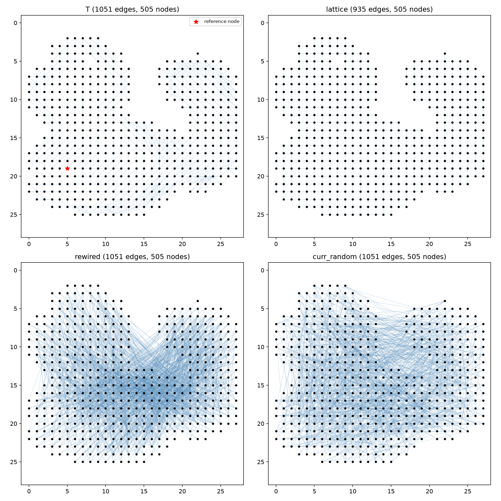
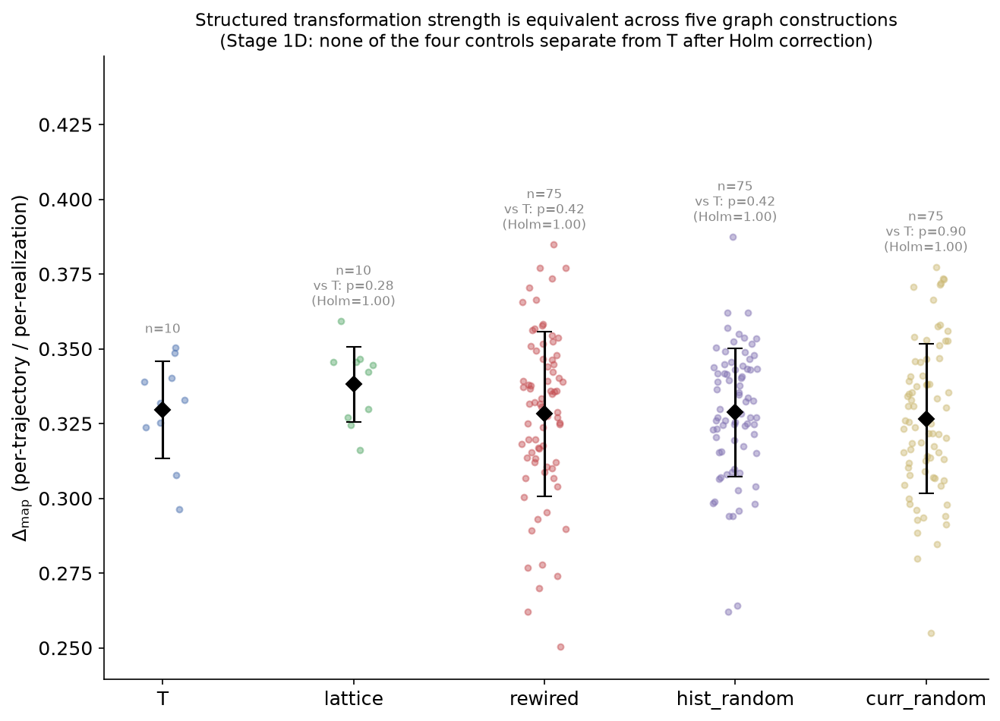
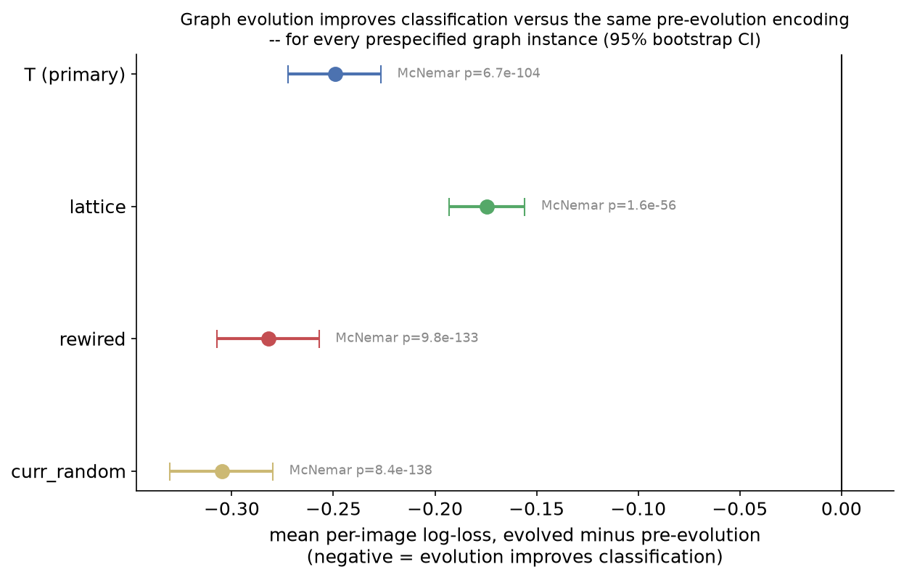
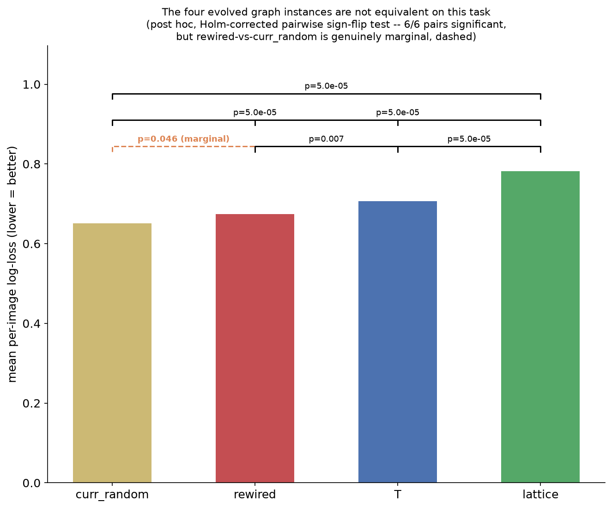
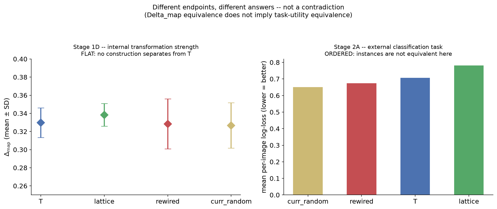

# Bonsai Week Notes: 1–4 August 2026

*138 commits, four days, one positive result, three self-corrections. This is
the orientation version — for the actual rigor, FINDINGS.md links are at the
bottom.*

## The one-sentence version

Running the oscillator dynamics on a graph built from KMNIST images makes
classification measurably better — for every graph shape tested, not just the
one the system learned from the data — and along the way the project caught
and fixed three of its own mistakes, in public, in the commit log.

## What these graphs actually are

Before the results: 505 nodes, laid out on the actual pixel footprint of a
KMNIST digit. `T` is the graph the earlier stages built from real image
statistics. `lattice` is pure nearest-neighbour grid structure — no learning
involved. `rewired` and `curr_random` have the same number of edges as `T`
(1051) but scrambled globally, two different ways.

Everything below asks the same underlying question about these four shapes,
from two different angles.

## What happened, in order

**1. Construction recovery.** The pickle cache underlying every stage
(`class0_constructions.pkl`) turned out to have no generating code left in
the repo — only the cached output survived. Most of it recovered byte-exact
(T, lattice, rewired). The historical "random" control didn't: it turned out
to follow a different edge-count rule than the modern algorithm. Documented
as a structural mismatch rather than quietly reconciled — its exact
historical seed still isn't recovered.

**2. Stage 1A re-verification.** Re-ran the original infinitesimal-response
finding with a fuller design (770 instances: 10 classes × 25 seeds × 3
stochastic controls, plus T/lattice). Two of three controls resolved to
clean nulls. The third — T vs. degree-preserving rewiring — got **demoted**
from "clean negative" to "genuinely inconclusive" once a class-2 outlier
surfaced under closer scrutiny. Reported as a downgrade of the original
finding, not two independent confirmations of it.

**3. Stage 1D — is the *learned* graph special?** Does T behave differently
from four cheaper stand-ins on the internal "structured transformation"
measure (Δ_map)? **No.** All five sit in one tight cluster; every
Holm-corrected comparison saturates at p = 1.00.

This is a real, honestly-reported null — not a failure, a closed question.
Something interesting is still happening (every construction hits the
permutation floor on its own internal transformation), it's just not
something *T specifically* has that the others don't.

**4. Stage 2A — the headline result.** Does *running* the dynamics actually
help classify digits, versus just using the pre-evolution encoding? **Yes —
for all four graph shapes**, not only T. Confidence intervals entirely below
zero on held-out log-loss, McNemar agrees, effect sizes from p≈1.6×10⁻⁵⁶ to
p≈8.4×10⁻¹³⁸.

But the four graphs aren't equivalent *to each other*. Ranked on this task:
`curr_random > rewired > T > lattice`. Five of the six pairwise gaps are
decisive; one — rewired vs. curr_random — is real but marginal (p≈0.046,
stable across five reruns, but no room to spare). The figure says so
explicitly rather than treating all six gaps as equally solid:

Put together, Stage 1D and Stage 2A don't contradict each other — they're
answering two different questions about the same four graphs, and the
project explicitly built a figure to prevent that exact misread:

**5. Two corrections, caught by external review, fixed the same day:**
- The pairwise significance test above was originally computed from a
  bootstrap centred on the *observed* effect — not a genuine null
  simulation. Replaced with a proper permutation test. Same qualitative
  conclusion, but that's what surfaced the rewired-vs-curr_random result as
  marginal rather than comfortable.
- A claim that evolution "preferentially preserves" class-discriminatory
  information was backwards. Corrected finding: evolution attenuates *both*
  common and discriminatory signal, just the discriminatory one more — which
  is arguably more interesting, since it points toward the dynamics
  reorganizing information rather than simply retaining more of it.

## What's still open

- Stage 1A's T-vs-rewiring comparison remains genuinely unresolved, not
  closed either way, under a pre-committed stopping rule.
- The historical "random" control's exact edge-count rule and seed are still
  not recovered — only the shape of the mismatch is documented.
- "Stage 2B" currently consists of one sentence in a review comment and a
  three-word GitHub issue title. Everything above was, at the start of this
  week, roughly that same size.

## The unglamorous part

Most of this ran over what was, calendar-wise, a weekend — coordinated
partly from a phone, at a music festival, through an MCP wrapper around the
Colab CLI that got built on impulse mid-investigation. An AI summarizing its
own week called it "a productive week." It was two days.

---

**For the actual rigor**, not the plain-English version:
`experiments/stage1a_re_verification/FINDINGS_v2_log_scale.md` ·
`experiments/stage1d_topology_specificity/FINDINGS.md` ·
`experiments/stage2a_dynamics_classification/FINDINGS.md` ·
`docs/PROJECT_MEMORY.md`
