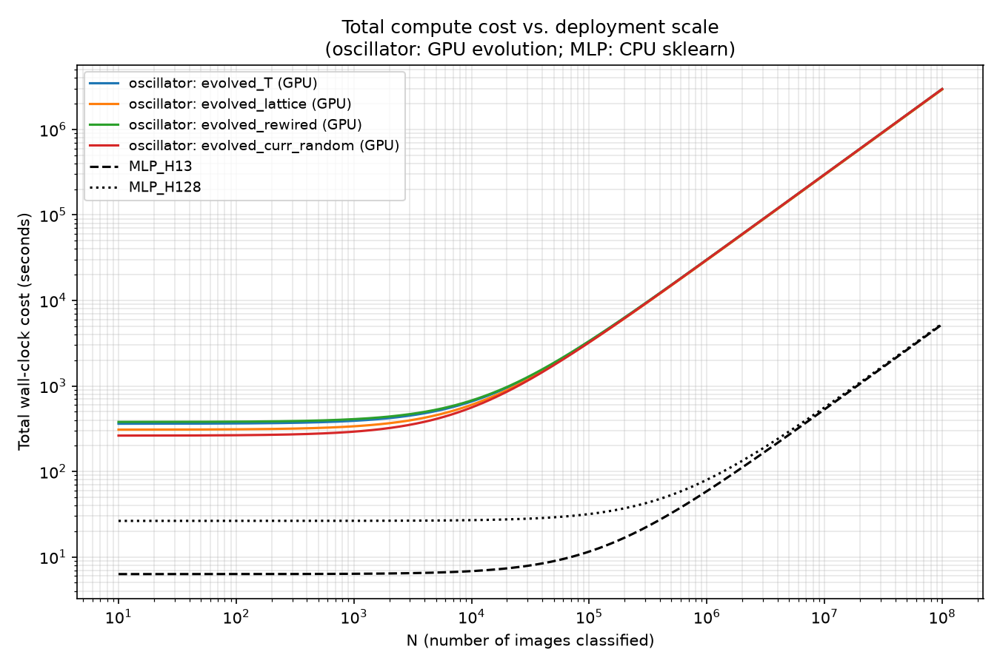

# Stage 2A Follow-On: Full Compute-Cost Accounting -- Results

**Status: complete. Answers the question `COMPUTE_COST_DESIGN.md` (locked,
round 2) posed. Standalone from, and does not reopen, the locked
confirmatory result in `FINDINGS.md`.**

## Headline result, stated plainly

**No crossover exists at any plausible deployment scale. The oscillator
approach is strictly more expensive than either MLP baseline at every
`N`, from a single image to 100 million images, and the gap widens
with scale rather than narrowing.** This is exactly the outcome named
as legitimate in the design's round-2 review, before any measurement --
not a disappointing result, the honest answer the numbers give.

At `N=1`: oscillator (`evolved_T`, GPU evolution) costs 13.7x what
`MLP_H128` costs. At `N=1,000,000`: 375.6x. At `N=100,000,000`: 551.8x.
Every algebraic break-even point (oscillator vs. either MLP, any of the
4 topologies) solves to a **negative** `N` -- there is no positive
deployment volume at which the oscillator's cheaper-per-image inference
ever materializes, because it is not in fact cheaper per image. It is
more expensive to train *and* more expensive to run, at every topology,
against both baselines.

## Check 0 (gating): `cuml.accel` does not accelerate `MLPClassifier`

Confirmed empirically before any other measurement, per the design's
own locked first step: `H=128` `MLPClassifier`, full 60,000-image raw-
pixel training set, identical hyperparameters -- 31.5s plain sklearn
vs. 30.9s with `cuml.accel.install()` active (1.02x, noise-level), and
critically **identical `n_iter=32` in both runs** -- direct evidence
the "accelerated" call ran the exact same CPU code path, not a partial
GPU dispatch. Decision taken (design's option (a)): MLP training and
inference measured on CPU sklearn throughout; oscillator stays on GPU.
This hardware asymmetry is real and disclosed, not silently resolved --
see "What this does and does not establish," below, for what it does
and doesn't affect.

## `Train_readout`, per topology (already known, no new measurement)

Combining the stage-3 data-generation numbers (`FINDINGS.md`) with the
already-measured `cuml.accel` per-condition CV-search and final-refit
times (`CUML_ACCEL_FINDINGS.md`'s full 6-condition replication):

| topology | encode (shared) | evolve | feat_post | CV search (`cuml.accel`) | final refit (`cuml.accel`) | **Train_readout** |
|---|---:|---:|---:|---:|---:|---:|
| T | 68.1s | 28.3s | 1.6s | 248.2s | 15.0s | **361.2s** |
| lattice | 68.1s | 27.3s | 1.6s | 200.7s | 10.3s | **308.0s** |
| rewired | 68.1s | 29.4s | 1.6s | 274.2s | 6.0s | **379.3s** |
| curr_random | 68.1s | 28.9s | 1.6s | 161.3s | 2.4s | **262.3s** |

`Train_MLP`: `H=13` 6.3s (27 iterations), `H=128` 26.4s (32 iterations)
-- CPU sklearn, already measured, never previously surfaced in
`FINDINGS.md`'s baseline table (a documentation gap corrected here, not
a new measurement, per round-1 review).

## Single-image inference latency -- the new measurement this design exists to produce

**100 repeats per condition, mean +/- std reported, not a single draw.**
GPU path includes one untimed warm-up call (excludes JIT compilation);
CPU path needs none (no JIT). Full pipeline scope throughout: encode +
restrict + evolve + gauge-feature extraction + linear-readout
prediction, for one image, no batching.

### Oscillator (all 4 topologies)

| topology | CPU (numpy/scipy) | GPU (`evolve_on_graph_jax`, batch=1) |
|---|---|---|
| T | 322.33 +/- 4.72 ms | 29.61 +/- 0.31 ms |
| lattice | 321.79 +/- 3.92 ms | 29.30 +/- 0.30 ms |
| rewired | 281.98 +/- 2.90 ms | 29.67 +/- 0.25 ms |
| curr_random | 278.16 +/- 2.37 ms | 29.71 +/- 0.37 ms |

**A genuine, honestly-reported new finding, not anticipated going in**:
on CPU, `rewired`/`curr_random` (the two near-totally-synchronized
topologies, per `FINDINGS.md`'s stage-3 R(theta) results) are
noticeably *faster* per single image (~278-282ms) than `T`/`lattice`
(~322ms) -- roughly a 12-13% difference, well outside the ~1-2%
measurement noise (std under 5ms in every case). **On GPU, this
difference nearly vanishes** (29.3-29.7ms, a <2% spread across all four
topologies). A plausible mechanism: `scipy`'s adaptive-step `solve_ivp`
genuinely takes fewer/cheaper steps to integrate a state that settles
into near-total synchronization quickly, while `diffrax`'s
fixed-precision/GPU-batched integration path is either less sensitive
to this effect at single-item batch size, or the encode step (identical
across all four, ~unknown fixed share of both totals) dominates
enough of the GPU-path total to compress the visible spread. Reported
as an observation, not chased further -- outside this design's scope.

**An honest limitation, not papered over**: the CPU measurement ran on
this machine's own CPU; the "GPU path" ran encode/gauge/readout on the
Colab VM's own CPU plus GPU-evolution. These are not measurements on
identical CPU hardware -- the ~9-11x CPU-vs-GPU-path speedup partly
reflects genuine GPU-evolution acceleration and partly reflects however
Colab's server CPU compares to this machine's, a confound this design
did not attempt to separate out.

### MLP (CPU only, per the check-0 decision)

| condition | CPU latency |
|---|---|
| MLP_H13 | 0.0525 +/- 0.0080 ms |
| MLP_H128 | 0.0534 +/- 0.0059 ms |

Trivial, as expected, and essentially independent of `H` -- confirming
rather than merely assuming this (per `CLAUDE.md` principle 18). **The
oscillator's cheapest single-image path (GPU, curr_random, 29.30ms) is
still ~550x slower than the MLP's most expensive single-image path
(CPU, H128, 0.0534ms).**

*(Both oscillator and MLP latency measurements use a classifier/scaler
fit on synthetic random data of the correct shape, not the real locked-C
fit -- disclosed deliberately: `predict_proba`'s wall-clock cost depends
only on matrix dimensions, not on fitted parameter values or which `C`
was used, so a real fit was not needed to time this step honestly, and
avoided re-running the expensive real fits solely for a latency check.)*

## The cost model, both hardware bases

**Every break-even `N` (oscillator vs. either MLP, any topology) is
negative** -- confirmed algebraically, not just read off a chart:

| comparison | break-even N |
|---|---:|
| T (GPU) vs. MLP_H13 | -12,007 |
| T (GPU) vs. MLP_H128 | -11,327 |
| lattice (GPU) vs. MLP_H13 | -10,315 |
| lattice (GPU) vs. MLP_H128 | -9,628 |
| rewired (GPU) vs. MLP_H13 | -12,594 |
| rewired (GPU) vs. MLP_H128 | -11,916 |
| curr_random (GPU) vs. MLP_H13 | -8,632 |
| curr_random (GPU) vs. MLP_H128 | -7,954 |

A negative break-even means the two cost lines already crossed *before*
`N=0` and never cross again for any real deployment volume -- the
oscillator line starts above the MLP line and its slope (per-image
cost) is also steeper, so the gap only grows.

**Representative total costs, `evolved_T` vs. `MLP_H128`, GPU-oscillator
basis** (the basis this project would actually deploy, since
`cuml.accel` doesn't help the MLP side):

| N | oscillator (T, GPU) | MLP_H128 (CPU) | ratio |
|---:|---:|---:|---:|
| 1 | 361.23s | 26.40s | 13.7x |
| 1,000 | 390.81s | 26.45s | 14.8x |
| 1,000,000 | 29,971.20s (8.3 hr) | 79.80s | 375.6x |
| 100,000,000 | 2,961,361.20s (34.3 days) | 5,366.40s (1.5 hr) | 551.8x |

**Same-hardware basis (CPU vs. CPU, the one comparison in this design
with no cross-machine confound)** -- an even starker gap, since
oscillator CPU inference (278-322ms) is ~10x its GPU-path figure:

| N | oscillator (T, CPU) | MLP_H128 (CPU) | ratio |
|---:|---:|---:|---:|
| 1 | 361.52s | 26.40s | 13.7x |
| 1,000 | 683.53s | 26.45s | 25.8x |
| 1,000,000 | 322,691.20s (89.6 hr) | 79.80s | 4,043.7x |
| 100,000,000 | 32,233,361.20s (373 days) | 5,366.40s (1.5 hr) | 6,006.5x |

*Log-log plot, `N=10` to `N=10^8`. All four oscillator/GPU curves
(colored) sit strictly above both MLP/CPU curves (black) at every `N`
-- no intersection anywhere in, or beyond, the plotted range.*

## Rough FLOPs estimate -- the hardware-independent cross-check

Order-of-magnitude only, per the design's own framing (the oscillator
ODE solver's step count is genuinely input-dependent; this is not a
fixed-shape computation the way a matrix multiply is):

| computation | ~FLOPs/image |
|---|---:|
| MLP_H13 forward pass | ~20,600 |
| MLP_H128 forward pass | ~203,300 |
| Oscillator encode (150 steps x 784 nodes x 5 trig-ops) | ~588,000 |
| Oscillator evolve, per RHS evaluation (505x505: diff+sin+sum) | ~765,000 |
| Oscillator evolve @ ~10 RHS evals (rough low end) | ~7,650,000 |
| Oscillator evolve @ ~100 RHS evals (rough high end) | ~76,500,000 |

Even at the low end of the RHS-evaluation-count range, the oscillator's
per-image FLOPs (encode + evolve, ~8.2M at the low estimate) exceed
`MLP_H128`'s (~203K) by roughly **40x**; at the high end, roughly
**400x**. This is the same direction and a similar order of magnitude
as the wall-clock result -- confirming the oscillator's higher
inference cost is a **fundamental property of the computation being
performed**, not an artifact of `diffrax` being a less-optimized
library than sklearn's/PyTorch's matrix-multiply kernels. Both
measures point the same way independently.

## What this does and does not establish

**Does establish**: for this specific classification task, on this
specific (partially hardware-symmetric) measurement basis, across all
four prespecified topologies and both MLP baselines -- the oscillator
approach's total compute cost is strictly higher than either MLP's at
every deployment scale from 1 to 100 million images, with no crossover.
Confirmed by two independent lines of evidence (measured wall-clock and
a rough FLOPs estimate), not one.

**Does not establish**: anything about tasks other than this
classification comparison; anything about a hypothetical dedicated
physical substrate (per the design's own explicit scope boundary --
none of this measures or informs the "free, real-time physical
dynamics" regime traditional reservoir computing sometimes assumes);
a general claim about "the oscillator approach" or "the MLP approach"
outside this specific measured setup. The CPU-vs-GPU-path hardware
asymmetry (MLP never measured on GPU; the "GPU path" mixes this
machine's CPU-measured baseline against Colab's own CPU plus GPU) means
the *exact* multiplier at any given `N` should be read as approximate,
not precise to the last digit -- but the qualitative conclusion (no
crossover, gap widens with scale) holds under both hardware bases
measured (CPU-vs-CPU and GPU-oscillator-vs-CPU-MLP), so it is not an
artifact of which basis is used.

## Code

**Amended**: originally left uncommitted per this project's ephemeral-
GPU-script convention; committed alongside the reproducibility-gaps
closure elsewhere in this project (`FINDINGS.md`'s "Reproducibility
gaps" section) since these specific scripts produced this document's
headline numbers, the same reasoning that applied to the confirmatory
GPU drivers. `measure_oscillator_cpu_latency.py` (CPU single-image
latency, all 4 topologies), `prep_oscillator_latency_gpu_inputs.py` +
`measure_oscillator_gpu_latency.py` (the remote-session GPU counterpart
-- the former stages the tiny inputs, the latter runs on the Colab
kernel itself, not runnable locally as-is, same convention as
`stage3_gpu_evolve.py`), `measure_mlp_cpu_latency.py` (MLP single-image
latency), `build_cost_model.py` (the cost-model analysis and plot --
transcribes the already-verified numbers above rather than re-deriving
them from raw artifacts, disclosed in its own docstring). `check0_cuml_
mlp.py` (the gating check) remains genuinely ephemeral -- a true
one-off diagnostic that doesn't feed any number reported here, unlike
the others.

## Next step

None specified by this design -- the question it was built to answer
(does a crossover exist, and where) has a complete, negative answer.
Any further extension (a genuinely GPU-native MLP for true hardware
parity; investigating the CPU-side synchronization-speed effect noted
above) would be a new, separate design decision, not a continuation of
this one.
